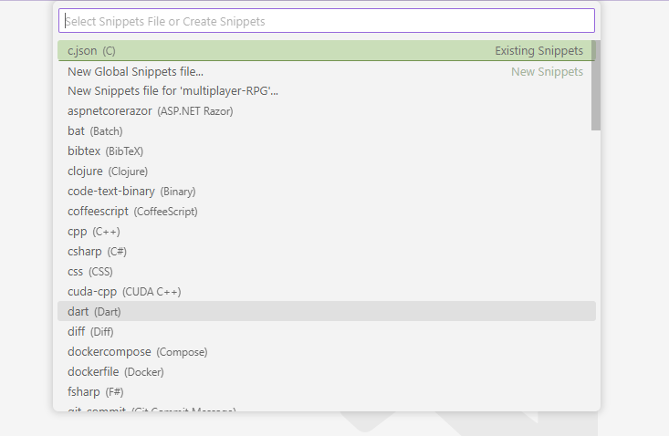
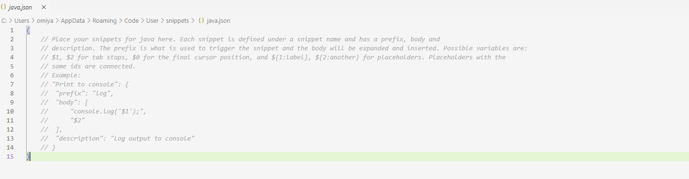
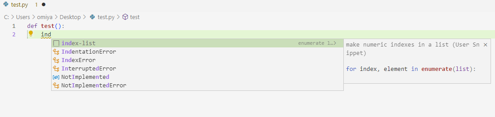

## Overview
Code Snippets are blocks of pre-written code that can be conveniently inserted into code through the IntelliSense shortcut menu. This section will detail how to create your own custom code snippet for any programming language you use in VS Code.  

## Steps
1\. From the **File** menu, *click* **Preferences** and then *click* **Configure User Snippets**.
  
This will display the snippets file selector popup.  
  
2\. *Find* and *select* the snippet file of your desired programming language using the search bar.

This will cause the snippet file (a JSON file) of the selected programming language to display in the editor. Code snippets are usually specific to a programming language (i.e., they can only be inserted while coding in that specific language). Optionally, you can make your snippet global for use in all languages by *clicking* **New Global Snippets file...**.  
  
3\. *Write* your code snippets in the following JSON format below.
```
    "enumerate list": {
		"prefix": ["enumerate"],
		"body": ["for index, in enumerate():\n\t"],
		"description": "make numeric indexes for a list"
    }
```
In this format, **prefix** is the specific text that will trigger the IntelliSense shortcut menu where you can select your snippet, **body** is what will be inserted if the user clicks the snippet shortcut in the IntelliSense shortcut menu, **description** is what is displayed alongside the snippet in the IntelliSense shortcut menu. You should also give your snippet a title (e.g., "enumerate list" in this example) that is displayed in the IntelliSense shortcut menu.
  
4\. *Fill out* the **prefix** value with your desired trigger words for the snippet.
```
    ...

    "prefix": ["enumerate", "e-list", "index-list"],

    ...
```
 This will be an array of strings that will cause the snippet shortcut (with the written name) to be displayed in the IntelliSense shorcut menu.
  
5\. *Fill out* the **body** value with the code snippet that will be inserted when the snippet shortcut is clicked.
```
    ...

    "body": ["for index, ${1:element} in enumerate(${2:list}):\n\t"],

    ...
```
Use *placeholder values* of $1, $2, $3, and so on in ascending order that allow you to *tab* through positions in the snippet where you can enter initial values when you choose to insert a snippet. The colons after these placeholder values set the default value if you choose not to enter a value at that position. Note that the **body** value is an array of strings that is joined into a single line when the snippet is inserted.
  
6\. *Fill out* a **description** value.
```
    ...

	"description": "make numeric indexes for a list"

    ...
```
This text will be displayed alongside the snippet title in the IntelliSense shortcut menu when the snippet shortcut is visible. 
  
7\. *Test* out your code snippet by *creating* a file in your selected programming language and *typing* the prefix words you entered previously. You can then *select* the code snippet with the prefix name from the IntelliSense menu.

The code snippet will be inserted at the cursor position.

## Conclusion
You have learned how to create your own code snippets in VS Code. Take a look at some of the other instruction guides to further improve your productivity in VS Code.