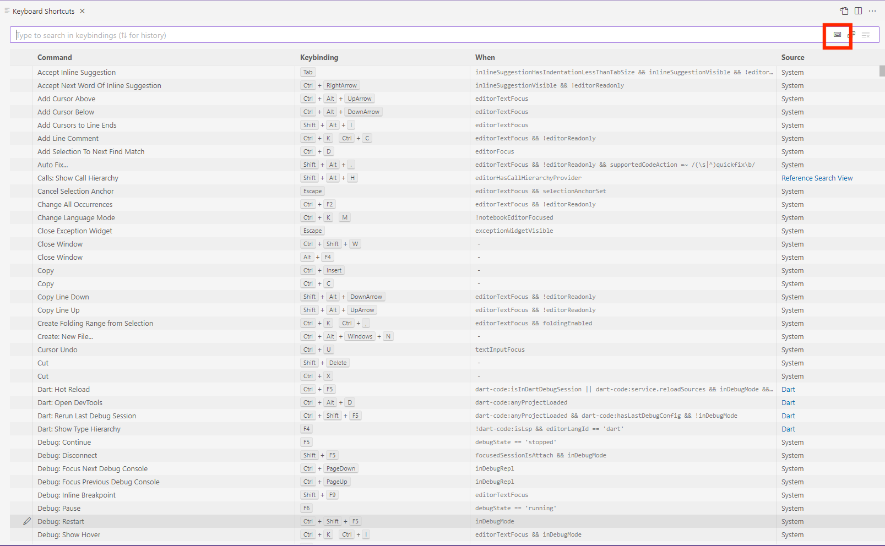
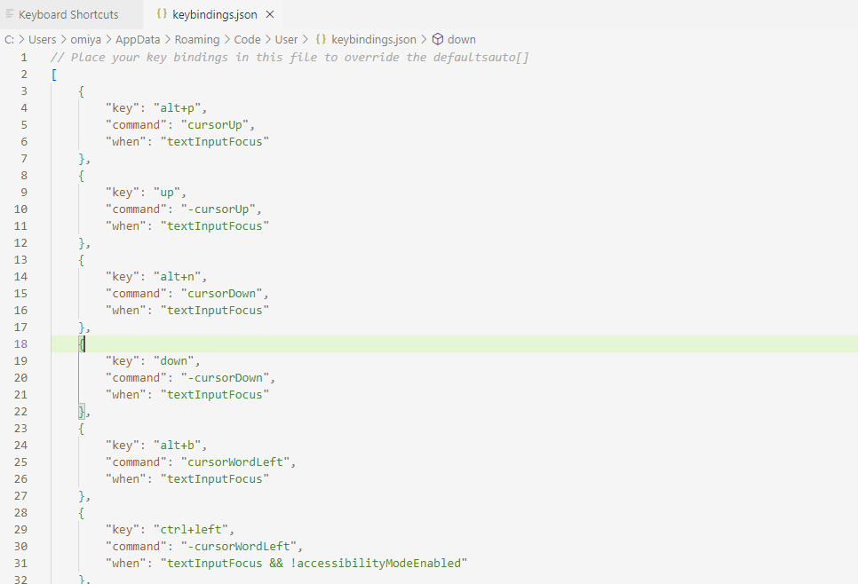

## Overview
These instructions detail how to bind keys to keyboard commands. There are two methods for setting custom key bindings. The first method is more convenient but is harder to use for complex key bindings. In those cases, you should use method 2, which allows for maximum customization.  

### Method 1: Keyboard Shortcuts Editor
1. From the **File** menu, click **Preferences** and then **Keyboard Shortcuts** to get to the keyboard shortcuts editor.

2. Search for the key command you want to change by entering the key command's name into the search bar at the top of the edtior. For a more convenient option, you can also click the **Record Keys** icon on the right hand side of the search bar to record key strokes typed into the search bar and search for key command's that are currently bound to the entered key(s). 

3. Hover over the key command you want to change and click the pencil icon that appears on the left to edit the current key binding.
 
4. Enter your desired key binding combination in the popup that appears and press enter. The pressed key(s) are now bound to the key command. 

### Method 2: JSON File
1. This method allows you to edit key bindings directly from the JSON file that is loaded by VS Code. Click the **Open Keyboard Shortcuts(JSON)** icon from the top right of the shortcut editor. 

2. You can add your own key bindings in JSON format into the keybindings.json tab that appears in your editor. 

3. Write your key command bindings in the JSON format below. In this format, **key** will take the key you want to bind, **command** will take the command identifier of the command that the key triggers, and **when** sets the scope of the key binding while in VS Code and is optional (the default is global editor scope).
```
{
    "key": "ctrl+p",
    "command": "deleteLeft",
    "when": "textInputFocus"
}
```

## Conclusion
You have learned how to set your own key bindings in VS Code. Take a look at some of the other instruction guides to further improve your productivity in VS Code.