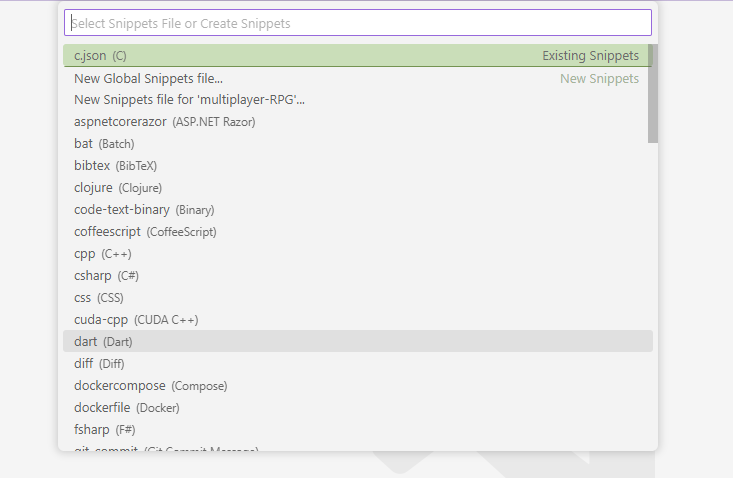
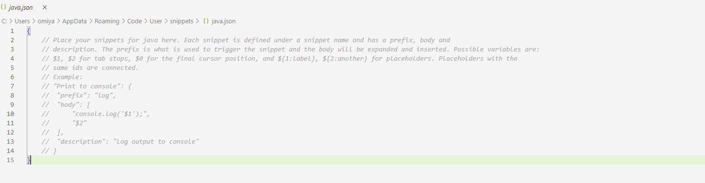

## Overview
Code Snippets are blocks of pre-written code that can be conveniently inserted into code through the IntelliSense shortcut menu. This section will detail how to create your own custom code snippet for any programming language you use in VS Code.  

## Steps
1. From the **File** menu, click **Preferences** and then **Configure User Snippets** to display the snippets file selector popup.

2. Code snippets are usually scoped by programming language so find and select the snippet file of your desired programming language using the search bar to add a snippet for it. This will cause the snippet file (a JSON file) to display in the editor. Optionally, you can make your snippet global for use in all languages by clicking **New Global Snippets file...**.

3. Write your code snippets in the following JSON format below. In this format, **prefix** is the specific text that will trigger the IntelliSense shortcut menu where you can select your snippet, **body** is what will be inserted if the user clicks the snippet shortcut in the IntelliSense shortcut menu, **description** is what is displayed alongside the snippet in the IntelliSense shortcut menu. You should also give your snippet a title (e.g., "enumerate list" in this example) that is displayed in the IntelliSense shortcut menu.
    ```
    "enumerate list": {
		"prefix": ["enumerate"],
		"body": ["for index, in enumerate():\n\t"],
		"description": "make numeric indexes for a list"
	}
    ```
4. Fill out the **prefix** value with your desired trigger words for the snippet. This will be an array of strings that will cause the snippet shortcut (with the written name) to be displayed in the IntelliSense shorcut menu.
    ```
    ...

    "prefix": ["enumerate", "e-list", "index-list"],

    ...
    ```
5. Fill out the **body** value with the code snippet that will be inserted when the snippet shortcut is clicked. Use *placeholder values* of $1, $2, $3, and so on in ascending order that allow you to *tab* through positions in the snippet where you can enter initial values when you choose to insert a snippet. The colons after these placeholder values set the default value if you choose not to enter a value at that position. Note that the **body** value is an array of strings that is joined into a single line when the snippet is inserted.
    ```
    ...

    "body": ["for index, ${1:element} in enumerate(${2:list}):\n\t"],

    ...
    ```
6. Fill out a **description** value that will be displayed alongside the snippet title in the IntelliSense shortcut menu when the snippet shortcut is visible. 
    ```
    ...

	"description": "make numeric indexes for a list"

    ...
    ```
7. Test out your code snippet by opening a file in your selected programming language and typing the prefix words you entered previously. You can select the code snippet with the prefix name from the IntelliSense menu and it will be inserted at the cursor position.


## Conclusion
You have learned how to create your own code snippets in VS Code. Take a look at some of the other instruction guides to further improve your productivity in VS Code.