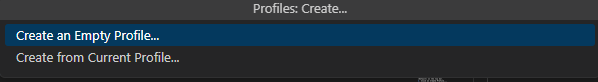

### Overview
In this section you will learn about creating, importing, and exporting user profiles. Profiles allow you to save your settings and extensions into a file. This is helpful when you want to keep them across devices. 

### Creating and Switching Profiles
This subsection will teach you about creating profiles and switching to them. We will be creating a blank state profile and switching to it.

1. **Navigate** to File > Preferences > Profiles (Default) on the top bar.

2. **Click** on Create Profile...
3. **Select** Create an Empty Profile...

4. **Input** a name for your profile and press Enter.

Your profile was created, so now you will switch to it to check.

5. Follow Step 1. to view the list of profiles.
6. **Click** on the profile with the name you previously entered.

You now know how to create a profile!

### Exporting a Profile
This section will teach you to export a profile as file.

1. **Navigate** to File > Preferences > Profiles (Default).

2. **Click** on Export Profile...
3. **Select** the settings or extensions you want to keep on the menu that appears on the left.

4. **Press** the Export button when finished.
5. **Input** a name for the profile and press Enter.
6. **Choose* Local file for Export Profile As.
7. **Select** a path where you want to **save** the file to.
8. A success window will pop up when the file is created

### Importing a Profile
This section will teach you to import a profile file that you or someone else may have created.

1. **Navigate** to File > Preferences > Profiles (Default).

2. **Select** "Import from profile file"

3. **Locate** the directory which contains your code-profile file and **click** open.
4. Verify the setting and extensions you want to keep and **select** Import Profile.

5. Your profile was successfully imported.

### Conclusion
At the end of this section, you will have mastered creating, importing, and exporting profiles. You will also know exactly what is saved inside of a profile file. Continue to the next section to learn more about VSCode.
