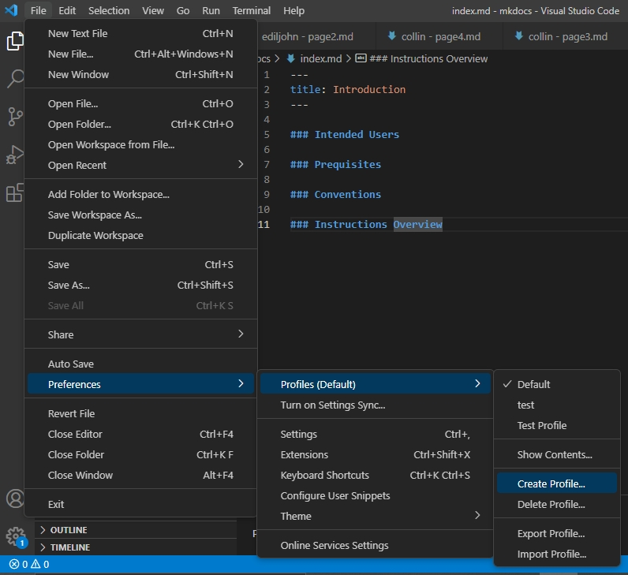
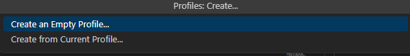
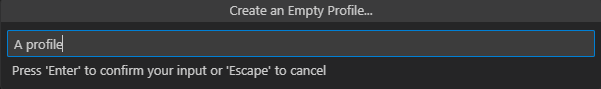
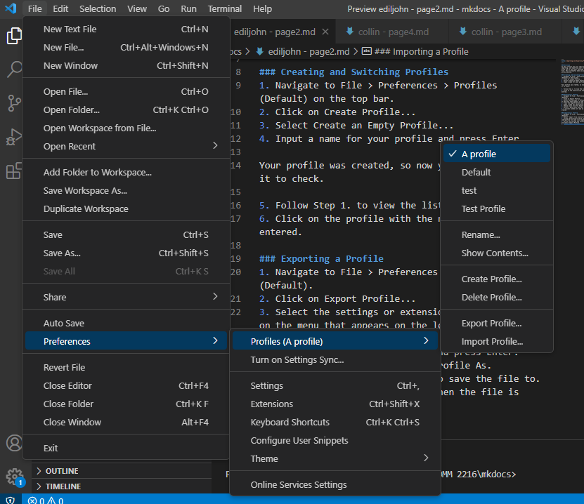
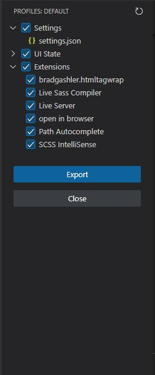
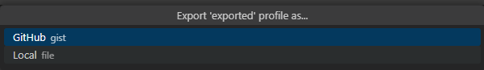
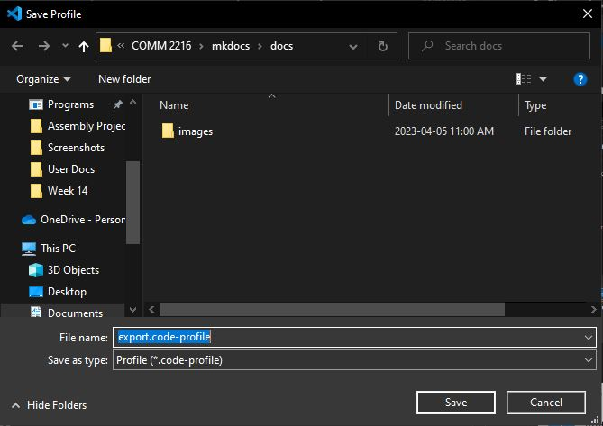
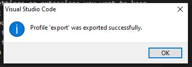
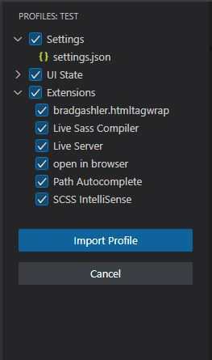

### Overview
In this section you will learn about creating, importing, and exporting user profiles. Profiles allow you to save your settings and extensions into a file. This is helpful when you want to keep them across devices. 

### Creating and Switching Profiles
This section teaches you about creating profiles and switching to them. You will create a blank state profile as part of this process.

1\. *Navigate* to **File > Preferences > Profiles** (Default) on the top bar.

  
2\. *Click* on **Create Profile...**

3\. *Select* **Create an Empty Profile...**  

There is also the option to create a profile from your current settings if you wish.

4\. *Input* a name for your profile and press **Enter.**

Your profile was created, so now you will switch to it to check.

5\. Follow Step 1. to view the list of profiles.
6\. *Click* on the **profile** with the name you previously entered.

You now know how to create a profile!

### Exporting a Profile
This section teaches you how to export a profile as file.

1\. *Navigate* to **File > Preferences > Profiles (Default).**

  
2\. *Click* on **Export Profile...**

3\. *Select* the **settings** or **extensions** you want to keep on the menu that appears on the left.  

You can *modify* the exact settings you want inside of the **settings.json** file.

4\. *Press* the **Export** button when finished.

5\. *Input* a name for the profile and press **Enter**.

6\. *Choose* **Local file** for **Export Profile As**.  

You can also *choose* to **save** the file as a GitHub gist, but *select* **Local file** for simplicity.

7\. *Select* a **path** where you want to **save** the file to.

8\. A **success window** will pop up when the file is created.  

You have now *created* a code-profile file, which you can **share** or **import** at a later time.

### Importing a Profile
This section teaches you to import a profile file that you or someone else may have created.

1\. *Navigate* to **File > Preferences > Profiles (Default).**

2\. *Select* **Import from profile file**  

You can also enter a Gist URL for this step.

3\. *Locate* the **directory** which contains your code-profile file and *click* **open**.

4\. *Verify* the setting and extensions you want to keep and *select* **Import Profile**.  

You have now imported the profile with all desired settings and extensions! 

### Conclusion
At the end of this section, you will have mastered creating, importing, and exporting profiles. You will also know exactly what is saved inside of a profile file. Continue to the next instruction section to learn more about VS Code.
